# Firebase Push Notification Implementation Flow

This document describes the **step-by-step implementation flow** I followed to integrate Firebase Cloud Messaging (FCM) push notifications in this Flutter application using Clean Architecture.

---

## Implementation Flow

### Step 1: Define Domain Entities

**Why First?**  
I needed to define the data structures that represent notifications in the business logic layer, independent of Firebase.

**What I Created:**

#### 1.1 NotificationPayloadEntity
```dart
// lib/src/domain/entities/notification_payload_entity.dart

enum NotificationType { collection, cart, home }

class NotificationPayloadEntity {
  NotificationPayloadEntity({
    required this.type,
    required this.collectionId,
    required this.collectionTitle,
    required this.checkOutUrl,
  });
  
  final NotificationType type;
  final String collectionId;
  final String collectionTitle;
  final String checkOutUrl;
}
```

**Purpose:**
- Represents the custom data payload from notifications
- Type-safe enum for notification routing
- Contains all data needed for navigation

#### 1.2 NotificationEntity
```dart
// lib/src/domain/entities/notification_entity.dart

import 'notification_payload_entity.dart';

class NotificationEntity {
  NotificationEntity({this.title, this.body, this.payload});

  final String? title;
  final String? body;
  final NotificationPayloadEntity? payload;
}
```

**Purpose:**
- Represents the complete notification
- Combines visible notification (title, body) with custom payload
- Domain-level abstraction (no Firebase types)

---

### Step 2: Create Abstract Repository Interface

**Why?**  
I needed to define what notification operations the domain layer expects, without knowing how they're implemented.

**What I Created:**

```dart
// lib/src/domain/repositories/notification_repository.dart

import '../entities/notification_entity.dart';
import '../entities/notification_payload_entity.dart';

abstract class NotificationRepository {
  Future<void> initializeNotification();
  Future<String?> getFcmToken();
  NotificationPayloadEntity? get payload;
  Stream<NotificationEntity> get onNotification;
}
```

**Purpose:**
- Contract for notification operations
- Domain layer depends on this interface, not implementation
- Defines: initialization, token retrieval, payload access, notification stream

---

### Step 3: Create Abstract Service Interface

**Why?**  
I needed a separate abstraction for the data layer to handle Firebase-specific operations.

**What I Created:**

```dart
// lib/src/data/services/notification/notification_service.dart

import '../../../domain/entities/notification_payload_entity.dart';
import '../../models/notification_model.dart';

abstract class NotificationService {
  Future<void> initialize();
  Future<String?> getFcmToken();
  NotificationPayloadEntity? get payload;
  Stream<NotificationModel> get onNotification;
}
```

**Purpose:**
- Data layer contract for Firebase operations
- Returns `NotificationModel` (not entity) because models live in data layer
- Will be implemented by `NotificationServiceImpl`

**Key Difference from Repository:**
- Service = Firebase implementation details
- Repository = Domain business operations

---

### Step 4: Create Data Models

**Why?**  
I needed models that can parse Firebase RemoteMessage JSON data into domain entities.

**What I Created:**

#### 4.1 NotificationPayloadModel
```dart
// lib/src/data/models/notification_model.dart

import 'package:dart_mappable/dart_mappable.dart';
import '../../domain/entities/notification_payload_entity.dart';

part 'notification_model.mapper.dart';

@MappableClass(generateMethods: GenerateMethods.decode)
class NotificationPayloadModel extends NotificationPayloadEntity
    with NotificationPayloadModelMappable {
  
  NotificationPayloadModel({
    String? type,
    String? collectionId,
    String? collectionTitle,
    String? checkOutUrl,
  }) : super(
          type: _mapStringToNotificationType(type),
          collectionId: collectionId ?? '',
          collectionTitle: collectionTitle ?? '',
          checkOutUrl: checkOutUrl ?? '',
        );

  factory NotificationPayloadModel.fromJson(Map<String, dynamic> json) =>
      NotificationPayloadModelMapper.fromJson(json);

  static NotificationType _mapStringToNotificationType(String? type) {
    switch (type?.toLowerCase()) {
      case 'collection':
        return NotificationType.collection;
      case 'cart':
        return NotificationType.cart;
      case 'home':
        return NotificationType.home;
      default:
        return NotificationType.home;
    }
  }
}
```

#### 4.2 NotificationModel
```dart
@MappableClass(generateMethods: GenerateMethods.decode)
class NotificationModel extends NotificationEntity
    with NotificationModelMappable {
  
  NotificationModel({
    required super.title,
    required super.body,
    required super.payload,
  });

  factory NotificationModel.fromJson(Map<String, dynamic> json) {
    return NotificationModelMapper.fromJson(json);
  }
}
```

**Purpose:**
- Parse JSON from Firebase RemoteMessage
- Convert string types to enums
- Extend domain entities for type compatibility
- Use dart_mappable for JSON serialization

---

### Step 5: Implement Notification Service

**Why?**  
This is where I implement all Firebase-specific logic.

**What I Created:**

```dart
// lib/src/data/services/notification/notification_service_impl.dart

import 'dart:async';
import 'package:firebase_messaging/firebase_messaging.dart';
import '../../../core/logger/log.dart';
import '../../../domain/entities/notification_payload_entity.dart';
import '../../models/notification_model.dart';
import 'notification_service.dart';

class NotificationServiceImpl extends NotificationService {
  FirebaseMessaging get _firebaseMessaging => FirebaseMessaging.instance;
  String? _cachedToken;
  NotificationPayloadEntity? _payload;
  
  final _notificationController = StreamController<NotificationModel>.broadcast();

  @override
  NotificationPayloadEntity? get payload => _payload;

  @override
  Stream<NotificationModel> get onNotification => _notificationController.stream;

  @override
  Future<void> initialize() async {
    // 1. Register background handler (MUST be top-level function)
    FirebaseMessaging.onBackgroundMessage(_firebaseMessagingBackgroundHandler);

    // 2. Request notification permissions
    await _firebaseMessaging.requestPermission();

    // 3. Get and cache FCM token
    final fcmToken = await _firebaseMessaging.getToken();
    _cachedToken = fcmToken;
    
    if (fcmToken != null) {
      Log.info('✅ FCM Token: $fcmToken');
    } else {
      Log.warning('⚠️ FCM Token is null. Make sure Firebase is configured correctly.');
    }

    // 4. Handle FOREGROUND messages
    FirebaseMessaging.onMessage.listen((RemoteMessage message) {
      Log.info('Foreground message: ${message.notification?.title}');
      Log.info('Message data: ${message.data}');

      final notification = _parseNotification(message);
      if (notification != null) {
        _payload = notification.payload;
        _notificationController.add(notification);
      }
    });

    // 5. Handle BACKGROUND → FOREGROUND (user taps notification)
    FirebaseMessaging.onMessageOpenedApp.listen((RemoteMessage message) {
      Log.info('App opened from background: ${message.notification?.title}');
      Log.info('Message data: ${message.data}');

      final notification = _parseNotification(message);
      if (notification != null) {
        _payload = notification.payload;
        _notificationController.add(notification);
      }
    });

    // 6. Handle TERMINATED → FOREGROUND (app opened via notification)
    final initialMessage = await _firebaseMessaging.getInitialMessage();
    if (initialMessage != null) {
      Log.info('App opened from terminated state via notification');
      Log.info('Message data: ${initialMessage.data}');

      final notification = _parseNotification(initialMessage);
      if (notification != null) {
        _payload = notification.payload;
        _notificationController.add(notification);
      }
    }
  }

  NotificationModel? _parseNotification(RemoteMessage message) {
    try {
      final payload = message.data.isNotEmpty
          ? NotificationPayloadModel.fromJson(message.data)
          : null;

      return NotificationModel(
        title: message.notification?.title,
        body: message.notification?.body,
        payload: payload,
      );
    } catch (e) {
      Log.error('Error parsing notification: $e');
      return null;
    }
  }

  @override
  Future<String?> getFcmToken() async {
    return await FirebaseMessaging.instance.getToken();
  }

  void dispose() {
    _notificationController.close();
  }
}

// MUST be top-level function for background handler
@pragma('vm:entry-point')
Future<void> _firebaseMessagingBackgroundHandler(RemoteMessage message) async {
  Log.info('''
╔═══════════════════════════════════════════════════════════════
║ 🔔 BACKGROUND MESSAGE RECEIVED
╠═══════════════════════════════════════════════════════════════
║ Message ID: ${message.messageId ?? 'N/A'}
║ Sent Time: ${message.sentTime ?? 'N/A'}
╠═══════════════════════════════════════════════════════════════
║ 📬 NOTIFICATION
║   Title: ${message.notification?.title ?? 'N/A'}
║   Body: ${message.notification?.body ?? 'N/A'}
╠═══════════════════════════════════════════════════════════════
║ 📦 DATA PAYLOAD
${message.data.isEmpty ? '║   ⚠️  No data payload' : message.data.entries.map((e) => '║   ${e.key}: ${e.value}').join('\n')}
╚═══════════════════════════════════════════════════════════════
  ''');
}
```

**Key Implementation Details:**
- Three listeners for three notification states
- Broadcast stream to allow multiple listeners
- Parse RemoteMessage → NotificationModel
- Cache FCM token
- Store latest payload in `_payload`
- Background handler must be top-level function with `@pragma('vm:entry-point')`

---

### Step 6: Implement Repository

**Why?**  
Repository bridges the domain layer with the data layer service.

**What I Created:**

```dart
// lib/src/data/repositories/notification_repository_impl.dart

import '../../domain/entities/notification_entity.dart';
import '../../domain/entities/notification_payload_entity.dart';
import '../../domain/repositories/notification_repository.dart';
import '../services/notification/notification_service.dart';

class NotificationRepositoryImpl extends NotificationRepository {
  NotificationRepositoryImpl(this._notificationService);

  final NotificationService _notificationService;

  @override
  Future<void> initializeNotification() {
    return _notificationService.initialize();
  }

  @override
  Future<String?> getFcmToken() {
    return _notificationService.getFcmToken();
  }

  @override
  Stream<NotificationEntity> get onNotification =>
      _notificationService.onNotification;

  @override
  NotificationPayloadEntity? get payload => _notificationService.payload;
}
```

**Purpose:**
- Implements domain repository interface
- Delegates to notification service
- Simple pass-through (no business logic here)
- Allows swapping service implementations

---

### Step 7: Create Use Cases

**Why?**  
Each notification operation needs a use case to encapsulate business logic.

**What I Created:**

```dart
// lib/src/domain/use_cases/notification_use_case.dart

import '../entities/notification_entity.dart';
import '../entities/notification_payload_entity.dart';
import '../repositories/notification_repository.dart';

// Use Case 1: Initialize notification system
class InitializaNotificationUseCase {
  InitializaNotificationUseCase(this._repository);
  NotificationRepository _repository;

  Future<void> call() async {
    return _repository.initializeNotification();
  }
}

// Use Case 2: Stream notifications
class GetNotificationStreamUseCase {
  GetNotificationStreamUseCase(this._repository);
  final NotificationRepository _repository;

  Stream<NotificationEntity> call() {
    return _repository.onNotification;
  }
}

// Use Case 3: Get FCM token
class GetFcmTokenUseCase {
  GetFcmTokenUseCase(this._repository);
  final NotificationRepository _repository;

  Future<String?> call() {
    return _repository.getFcmToken();
  }
}

// Use Case 4: Get current payload
class GetNotificationPayloadUseCase {
  GetNotificationPayloadUseCase(this._repository);
  final NotificationRepository _repository;

  NotificationPayloadEntity? call() {
    return _repository.payload;
  }
}
```

**Purpose:**
- Each use case has a single responsibility
- Called from presentation layer
- Provides clean API for notification operations

---

### Step 8: Setup Dependency Injection

**Why?**  
I needed to wire all the layers together using Riverpod.

**What I Created:**

#### 8.1 Service Provider
```dart
// lib/src/core/di/parts/services.dart

part of '../dependency_injection.dart';

@Riverpod(keepAlive: true)
NotificationService notificationService(Ref ref) {
  return NotificationServiceImpl();
}
```

#### 8.2 Repository Provider
```dart
// lib/src/core/di/parts/repository.dart

part of '../dependency_injection.dart';

@Riverpod(keepAlive: true)
NotificationRepository notificationRepository(Ref ref) {
  return NotificationRepositoryImpl(ref.read(notificationServiceProvider));
}
```

#### 8.3 Use Case Providers
```dart
// lib/src/core/di/parts/use_cases.dart

part of '../dependency_injection.dart';

@riverpod
InitializaNotificationUseCase initializaNotificationUseCase(Ref ref) {
  return InitializaNotificationUseCase(
    ref.read(notificationRepositoryProvider),
  );
}

@riverpod
GetNotificationStreamUseCase getNotificationStreamUseCase(Ref ref) {
  return GetNotificationStreamUseCase(ref.read(notificationRepositoryProvider));
}

@riverpod
GetFcmTokenUseCase getFcmTokenUseCase(Ref ref) {
  return GetFcmTokenUseCase(ref.read(notificationRepositoryProvider));
}

@riverpod
GetNotificationPayloadUseCase getNotificationPayloadUseCase(Ref ref) {
  return GetNotificationPayloadUseCase(
    ref.read(notificationRepositoryProvider),
  );
}
```

**Key Decision:**
- Used `keepAlive: true` for service and repository
- Ensures they persist throughout app lifecycle
- Stream subscriptions remain active

---

### Step 9: Initialize in App Startup

**Why?**  
I needed notifications to be ready before the app UI loads, especially for terminated state notifications.

**What I Created:**

```dart
// lib/src/presentation/core/application_state/startup_provider/app_startup_provider.dart

import 'package:firebase_core/firebase_core.dart';
import 'package:flutter_riverpod/flutter_riverpod.dart';
import 'package:riverpod_annotation/riverpod_annotation.dart';
import '../../../../../firebase_options.dart';
import '../../../../core/di/dependency_injection.dart';
import '../localization_provider/localization_provider.dart';

part 'app_startup_provider.g.dart';

@Riverpod(keepAlive: true)
Future<void> appStartup(Ref ref) async {
  ref.onDispose(() {
    ref.invalidate(sharedPreferencesProvider);
  });

  // 1. Initialize Firebase (MUST be first)
  await Firebase.initializeApp(options: DefaultFirebaseOptions.currentPlatform);

  // 2. Initialize SharedPreferences
  await ref.watch(sharedPreferencesProvider.future);

  // 3. Setup localization
  await ref.read(localizationProvider.notifier).setCurrentLocal();

  // 4. Initialize notifications (MY IMPLEMENTATION)
  await ref.watch(initializaNotificationUseCaseProvider).call();
}
```

**Purpose:**
- Ensures Firebase is initialized before FCM
- Notifications ready when app UI loads
- Catches terminated state notifications

---

### Step 10: Integrate with Router for Navigation

**Why?**  
I needed to listen to the notification stream and navigate based on payload type.

**What I Created:**

```dart
// lib/src/presentation/core/router/router.dart

@Riverpod(keepAlive: true)
GoRouter goRouter(Ref ref) {
  // Get the notification stream use case
  final notificationRouteUseCase = ref.read(
    getNotificationStreamUseCaseProvider,
  );
  
  // Listen to notification stream
  notificationRouteUseCase.call().listen((notificationEntity) {
    final context = _rootNavigatorKey.currentContext;
    if (context == null) return; // Context not ready
    
    final payload = notificationEntity.payload;
    if (payload != null) {
      Log.info(
        'Received notification with payload type: ${payload.type}, navigating accordingly.',
      );
      
      // Navigate based on notification type
      switch (payload.type) {
        case NotificationType.collection:
          context.go(Routes.collection);
          break;
        case NotificationType.cart:
          context.go(Routes.cart);
          break;
        default:
          context.go(Routes.home);
      }
    }
  });

  return GoRouter(
    navigatorKey: _rootNavigatorKey,
    debugLogDiagnostics: true,
    refreshListenable: ref.asListenable(routerStateProvider),
    initialLocation: Routes.initial,
    redirect: (context, state) {
      // ... existing redirect logic with authentication guards
      
      // Check if user is trying to access protected routes
      final protectedRoutes = [Routes.home, Routes.profile, Routes.cart];
      final isAccessingProtectedRoute = protectedRoutes.contains(state.uri.path);

      if (isAccessingProtectedRoute) {
        final isLoggedIn = ref.read(getUserLoginStatusUseCaseProvider).call();

        if (!isLoggedIn) {
          // Save the intended route for later redirection
          ref.read(saveIntendedRouteUseCaseProvider).call(state.uri.path);
          Log.info('User not logged in, saving intended route: ${state.uri.path}');

          // Redirect to login
          return Routes.login;
        }
      }

      return null;
    },
    routes: [
      // ... existing routes
    ],
  );
}
```

**Key Implementation:**
- Listen to stream inside `goRouter` provider
- Use `_rootNavigatorKey.currentContext` for navigation
- Switch on `payload.type` to determine route
- Router `redirect` automatically handles authentication
- If user not logged in, saves intended route and redirects to login

---

### Step 11: (Optional) Create Notification Provider for Manual Access

**Why?**  
In case I need to manually access the current notification payload from anywhere in the app.

**What I Created:**

```dart
// lib/src/presentation/core/providers/notification_provider.dart

import 'package:riverpod_annotation/riverpod_annotation.dart';
import '../../../core/di/dependency_injection.dart';
import '../../../domain/entities/notification_payload_entity.dart';

part 'notification_provider.g.dart';

@riverpod
class NotificationPayload extends _$NotificationPayload {
  @override
  NotificationPayloadEntity? build() {
    return ref.read(getNotificationPayloadUseCaseProvider).call();
  }

  void refresh() {
    state = ref.read(getNotificationPayloadUseCaseProvider).call();
  }
}
```

**Purpose:**
- Provides reactive access to current payload
- Can be watched from any widget: `ref.watch(notificationPayloadProvider)`
- Refresh method to manually update

---

## Complete Flow Diagram

```mermaid
---
config:
      theme: redux
---
flowchart TD
    Start(["Step 1: Define Entities"])
    Start --> Step2["Step 2: Create Repository Interface<br/>(NotificationRepository)"]
    Step2 --> Step3["Step 3: Create Service Interface<br/>(NotificationService)"]
    Step3 --> Step4["Step 4: Create Data Models<br/>(NotificationModel, NotificationPayloadModel)"]
    Step4 --> Step5["Step 5: Implement Service<br/>(NotificationServiceImpl)"]
    
    Step5 --> Step5a["Register background handler"]
    Step5a --> Step5b["Request permissions"]
    Step5b --> Step5c["Get & cache FCM token"]
    Step5c --> Step5d["Setup 3 listeners:<br/>Foreground, Background, Terminated"]
    Step5d --> Step5e["Parse & add to stream"]
    
    Step5e --> Step6["Step 6: Implement Repository<br/>(NotificationRepositoryImpl)"]
    Step6 --> Step7["Step 7: Create Use Cases<br/>(Initialize, GetStream, GetToken, GetPayload)"]
    Step7 --> Step8["Step 8: Setup DI<br/>(Service, Repository, Use Case Providers)"]
    Step8 --> Step9["Step 9: Initialize in App Startup<br/>(appStartupProvider)"]
    Step9 --> Step10["Step 10: Integrate with Router<br/>(Listen to stream, navigate based on type)"]
    Step10 --> Step11["Step 11: (Optional) Create Provider<br/>(NotificationPayloadProvider)"]
    Step11 --> End(["Implementation Complete"])
    
    style Start fill:#4CAF50,color:#fff
    style End fill:#4CAF50,color:#fff
    style Step5 fill:#2196F3,color:#fff
    style Step9 fill:#FF9800,color:#fff
    style Step10 fill:#9C27B0,color:#fff
```



---

## Key Decisions & Rationale

### Why Separate Service and Repository?
- **Service**: Handles Firebase-specific implementation
- **Repository**: Defines domain operations
- **Benefit**: Easy to swap Firebase for OneSignal or another provider

### Why Use Streams?
- Single source of truth for all notification states (foreground, background, terminated)
- Reactive architecture - router automatically responds
- Multiple parts of app can listen

### Why Initialize in App Startup?
- Ensures Firebase initialized first
- Notifications ready before UI
- Catches terminated state notifications

### Why Listen in Router?
- Central navigation point
- Has access to navigation context
- Respects existing authentication guards
- Natural integration with GoRouter

### Why Use Use Cases?
- Single responsibility principle
- Clean API for presentation layer
- Easy to test
- Business logic encapsulation

---

## What I Learned

### Corner Cases I Handled

1. **Context not available**: Check if `_rootNavigatorKey.currentContext` exists before navigating
2. **Parsing errors**: Try-catch in `_parseNotification`, return null gracefully
3. **Background handler requirements**: Must be top-level function with `@pragma('vm:entry-point')`
4. **Token caching**: Cache in memory to avoid repeated API calls
5. **Stream management**: Use broadcast stream for multiple listeners

### Platform Differences

**iOS:**
- Permission required, shows dialog
- If denied, FCM token is null
- Cannot re-request programmatically

**Android:**
- Android 12 and below: Auto-granted
- Android 13+: Permission dialog (like iOS)
- FCM token generated even if permission denied (data messages still work)

---

## Testing the Implementation

### 1. Test FCM Token Generation
```dart
// In any widget
final token = await ref.read(getFcmTokenUseCaseProvider).call();
print('FCM Token: $token');
```

### 2. Test Notification Stream
```dart
// In router or widget
ref.read(getNotificationStreamUseCaseProvider).call().listen((notification) {
  print('Notification: ${notification.title}');
  print('Payload: ${notification.payload?.type}');
});
```

### 3. Send Test Notification from Firebase Console
1. Go to Firebase Console → Cloud Messaging
2. Click "Send test message"
3. Enter your FCM token
4. Add custom data:
   - `type`: "collection"
   - `collectionId`: "123"
   - `collectionTitle`: "Test"
   - `checkOutUrl`: "https://example.com"

### 4. Test All Three States
- **Foreground**: App open, send notification
- **Background**: Minimize app, send notification, tap it
- **Terminated**: Force close app, send notification, tap to open

---

## Summary

This implementation follows **Clean Architecture** by:

1. ✅ **Domain Layer**: Entities, Repository interface, Use Cases (no Firebase dependencies)
2. ✅ **Data Layer**: Service implementation, Repository implementation, Models (Firebase-specific)
3. ✅ **Presentation Layer**: Router integration, Providers (UI logic)

**Flow:**
```
Firebase → Service → Repository → Use Case → Router → Navigation
```

**Key Benefits:**
- Testable (can mock at each layer)
- Maintainable (separation of concerns)
- Scalable (easy to add features)
- Platform agnostic domain layer
